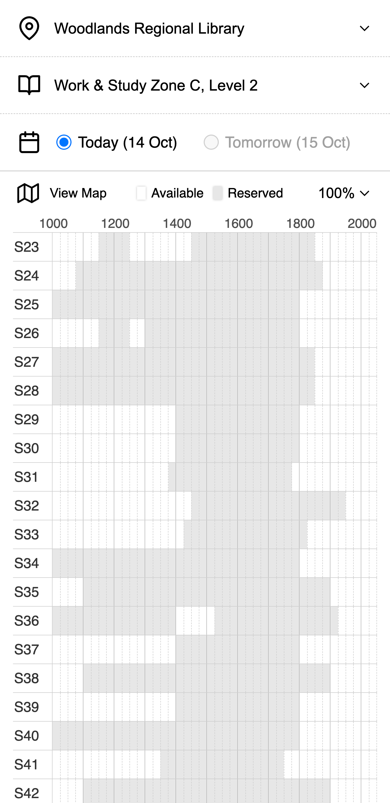

# NLB Seatings App

Mobile web application that displays seat availabilities for SG's NLB libraries.

Built with React & Next.js.

Try it here: [nlb-seatings-app.vercel.app](https://nlb-seatings-app.vercel.app/)!



## More Info

This application gets seat availabilities information from the National Library Board (NLB) via their (unofficial) seat booking API. Data for a new booking day is released every day at 12 noon for the following day's availability.

The displayed seat availabilities information is refreshed every 5 mins.

## Getting Started

Follow these steps to setup the project locally.

**Prerequisites**:

- node.js (v24+)
- npm

**Installation**:

1. Install dependencies: `npm install`

2. Run the development server: `npm run dev`.

The application will be accessible at `localhost:3000`.

## Technical Overview

The application is built with efficient client-server synchronisation and caching to minimise request calls in mind.

- Framework: React, Next.Js.
- Language: TypeScript.
- Styling: Vanilla HTML, CSS.
- Database: None (Data accessed via server proxy).
- Server: CORS proxy + data processing + caching
- Server Caching: Lazy, with request coalescing.
- Client Caching: Stale-While-Revalidate pattern (SWR), server-synced timestamps.

### Frontend

The application is a Single Page Application (SPA) aimed at being simple and easy to use. It displays seat availabilities for a particular library area. The three selectors are placed at the top to label the selected library, area, and date of the displayed seat availabilities.

### Backend

The computation can be thought of as a series of data transformations (pure functions) from the NLB API to the client, where the server acts primarily as a proxy to provide CORS support and facilitate data caching (memoisation). Ideally, the use of a server is optional. The server is designed to be lazy, only retrieving information from the NLB API when requested by the client. Request coalescing is implemented to prevent multiple simultaneous client requests from redundantly calling the external library API (as each call to check seat availabilities for a single library and day involves approximately 40 API calls). Client caching synchronizes with the server cache using timestamps (to prevent compounding out-of-date information from the NLB API).

#### Dates, Timezones...

The application (and server) can be run anywhere and always uses SG timezone.

## Thoughts

Learnt a lot about React. Implementing custom SWR using effects was really a challenge.

**Code of the day** 🤔

```ts
function useImpure<T>(impure: T): [T, () => void] {
  const [[get], set] = useState<[[T]]>([[impure]])
  const refresh = useCallback(() => set([get]), [get])
  get[0] = impure
  return [impure, refresh]
}
```

Much thanks for those who inspired this project idea!
